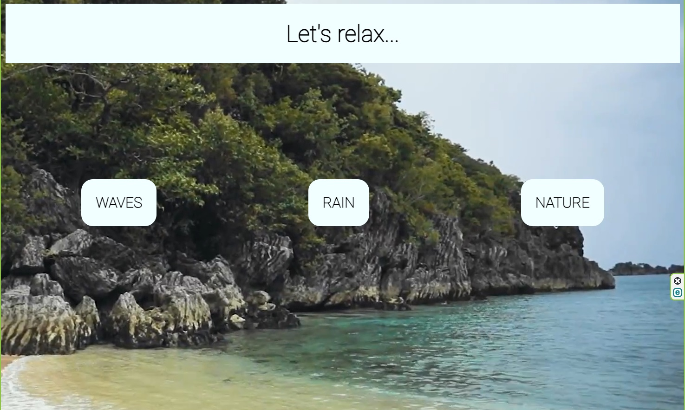

# Приложение-таймер

### Описание:
Это приложение создано для того, чтобы мы погрузились в релакс, послушали звуки природы, шум дождя или шум волн.
Чтобы выбрать, какие звуки сейчас послушать - нужно нажать кнопку. Каждая кнопка приведет нас на новую страницу, где сразу включится видео с выбранным содержанием.

### Стек:

### Ссылка на рабочий сайт:
https://shimmering-kitten-1352cc.netlify.app/

### Ссылка на GitHub Pages:
https://github.com/angilo4ik85/3prilozOpogode.git
